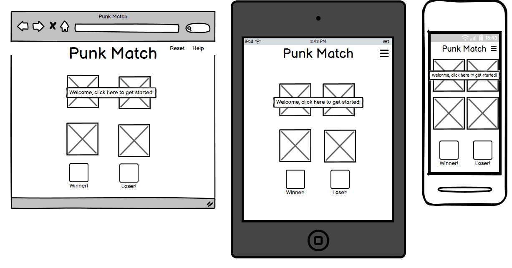

# Samantha Spencer

This is a simple memory based match game with a punk theme to keep things lively.

### Interesting notes

+ When deciding on reaction times and the time taken for certain things to happen on the page, for example, card flips, i really wanted to make sure that it was a psychologically reasonable time frame. Memory games are about ensuring the match itself is registered and if no match is found, allowing the brain to remember what has been seen to allow for the next match to be easier. For those of us of a younger disposition it is much easier for us to remember things within a quicker time frame. As we get older it becomes harder to retain information. I would like to be able to add a function to the game where you input your age before you start meaning the game would change the amount of time the cards were on the screen dependant on what your theoretical mental capacity was. I have not done it on this version of the game because i ran out of time to add the function properly but i think it would have been a really nice addition.

## User interactions

I will have 12 cards on show in the game, each of which has a back, with the same image on, just like a set of playing gards. Then on the other side of the cards there will be six images, each of which has an exact matching card. Then the player simply clicks to choose a card and then again for a second card. Once the player has picked two cards initially the game will work out if they match or not. If they match they will stay flipped over so the player knows. If they don't match they will flip back over to the back back side automatically and this will repeat until all cards are matched. Every time a match is found the 'pairs' score will go up.

## Wireframe of the site on all screen sizes:

I have sketched up the initial design in mobile, tablet and monitor sizes so that there is a baseline to work from. The bulk of the images will come from AI generation, so there will be no risk of plagiarism. I have also used icons as images for the cards - these have been attributed below. In complete honesty after completing the project I have gone back through this and noticed I created my wireframe with a lot less interactivity. This developed as the project developed as it allows me to show off my JavaScript more.

+ 

## How to:

### Dependencies and Credits

This will be for dependencies as I go through this project - complete as they come through.
+ [Bootstrap](https://getbootstrap.com/) has been used throughout the project to add items like a navbar and a footer. The main reason for this is to mitigate the need for written Javascript to create a responsive site. I have annotated throughout the project, the key areas this has been used.
+ [Favicon.io](https://favicon.io/emoji-favicons/love-you-gesture) has been used to generate a quick to recognise image for a favicon meaning you can link it to the page in each tab.
+ [Font Awesome](https://fontawesome.com/kits/524dbc89dc/setup) has been used to add icons and allow them to be easily edited.
+ [Google Fonts](https://fonts.google.com/selection/embed) has been used to give a consistent font accross the site. I have chosen this font as it has a clean look but with a bit of a gothic style to it.
+ [Microsoft Image Designer](https://designer.microsoft.com/image-creator) has been used to create images for the site, including the background and some of the more advanced tiles.
+ [IMGOnline](https://www.imgonline.com.ua/eng/get-dominant-colors.php) has been used to pull the dominant colours out of my 'milestone-1-background' image to create a baseline for the website.
+ [HTML and CSS3 for dummies book](https://www.dummies.com/article/technology/programming-web-design/html5/html5-and-css3-all-in-one-for-dummies-cheat-sheet-207788/) has been used as a booster on the Code Institute lesson content to enhance my learning and add some extra tips and tricks in.
+ [Coding with JavaScript for dummies book](https://www.dummies.com/article/technology/programming-web-design/javascript/javascript-for-dummies-cheat-sheet-207619/) has been used in addition to the above book to enhance my learning of JavaScript.
+ [Flaticon]("https://www.flaticon.com/free-icons/punk") Has been used to generate some generic punk themed icons for my playing cards.
+ [W3 Schools](https://www.w3schools.com/js/js_popup.asp) Has been used to better understand the alerts used for the step by step instructions and congratulatory messages.

## Bug problems and solutions

These bugs were found as I was writing the code, not whilst testing, hence being at this point in the README file.

+ I have set the height and width of the card-game to 640px because the cards then show in the same ratio as an actual card game, however when I then added the navbar to the top of the page, the cards were dropping off the bottom of the page. I decided to leave it at 640px with a few flex adjustments to allow for the page to change with screen sizes using media queries.
+ Having set up the basic framework for the game and being happy with the initial functionality of it i found that when reducing screen size down to below 768px (tablet screen size) i was going down to only three cards per row. Initially i adjusted the media queries to reduce the overall size of the game but did not factor in the overall size of cards plus margins. I decided that the best way to resolve this was to continue on from the above error and use media queries to add to the flex characteristics of the page.

## Source for images and text

All images below have been compressed using iloveimg.com to help with load speed on the website.

+ [Punk Themed Image](assets/images/punk-match.jpeg) alt, A themed image of different punk items with a neon lit background.
+ [Punk Guitar](assets/images/punk-guitar.jpeg) alt, A punk designed guitar with a festival croud in the background.
+ [Patch Jacket](assets/images/patch-jacket.jpeg) alt, A denim jacket with patches and studs.
+ [Punk Bar](assets/images/punk-bar.jpeg) alt, A punk themed bar with a live band playing.
+ [Guitar Icon](assets/images/guitar-icon.png) alt, A simple electric guitar icon.
+ [Back of Card Logo](assets/images/card-back-punk.png) alt, A side on line icon of a person with a mohawk.
+ [Rock/Punk hand sign with mic](assets/images/rock-punk-icon.png) alt, A line icon of a hand doing the rock sign holding a mic.

## Deployment process

Running the project locally:
1. Ensure you have a GitHub account [Create one here](https://docs.github.com/en/get-started/start-your-journey/creating-an-account-on-github).
2. Use Google Chrome as the best browser for this deployment.
3. Install VSCode to your computer or open the browser version [here](https://vscode.dev/).
4. Click the 'Open Remote Repository' button on the home page to clone and or edit as you wish.

To do the above you may need to follow these steps also:
1. Open the repository in GitHub [here]()
2. Under the name, click 'clone or download'.
3. Once in the clone section copy the HTTP clone URL for the repository.
4. In the local IDE of your choice, open the terminal.
5. Change the current working directory to wherever you want it to be made.
6. Type `git clone`, and then paste the URL you copied in step 3.

Deployment, step-by-step guide:
+ In GitHub, first, ensure all work is committed and pushed, then go to the settings tab on GitHub, then the Pages section on the left-hand navigation.
+ Once in the Pages section on GitHub change the branch drop down to 'Main' and then click the save option.
+ Now go back to the code section of GitHub and click the deployment link on the right-hand side. (You may need to refresh the page to see the deployment link)
+ Once on the deployment page on GitHub click on the provided link and it will open up the deployed project.

## Testing

### Testing through a linter:

I used JSLint to test my Javascript to ensure it passes through a linter.
+ 13 initial problems found when testing through JSLint on my .js file.
+ Problems one and two were because the line exceeded 80 characters. Unfortunately this is because there is a message for the user in them.
+ Problem two is because I have called two functions in the same let. This is to minimize the required code instead of repeating myself.
+ Problem four was a suggestion to put a function inside a function instead of using a arrow function. I have chosen to leave this as is otherwise it is more confusing to me having a function within a function.
+ Problem six is as a result of having a number of action within a single function. I have again chosen to leave this function as I had written it as this is easier to read and understand due to the complexity of the function itself.
+ Problem five and problem seven through to thirteen are the same as problems one and two, caused by over 80 characters per line. These are comments for my benefit and a note to the user so again must stay as they are.

### Testing as a user for navigation purposes:
+ 

### Testing with validators:

+ For all bugs I encountered whilst writing my initial code please refer to the 'bugs section' further up this page.